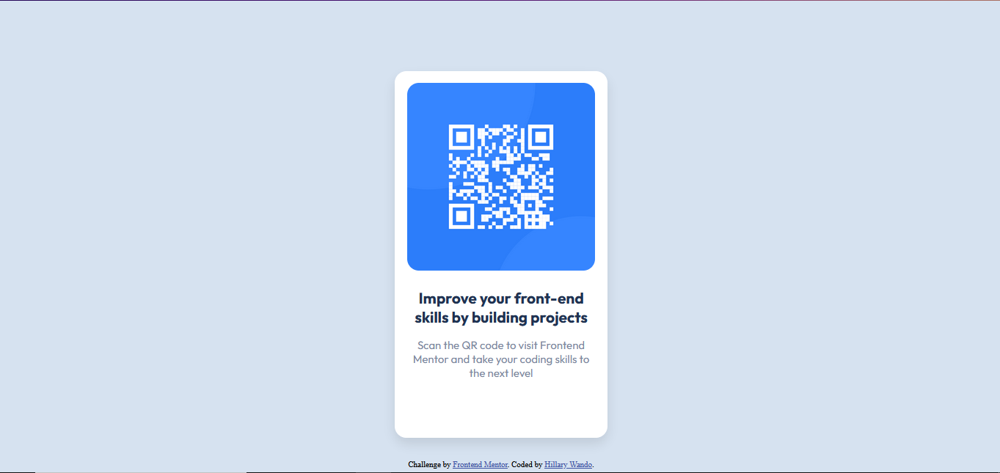

# Frontend Mentor - QR code component solution

This is a solution to the [QR code component challenge on Frontend Mentor](https://www.frontendmentor.io/challenges/qr-code-component-iux_sIO_H). Frontend Mentor challenges help you improve your coding skills by building realistic projects. 

## Table of contents

- [Frontend Mentor - QR code component solution](#frontend-mentor---qr-code-component-solution)
  - [Table of contents](#table-of-contents)
  - [Overview](#overview)
    - [Screenshot](#screenshot)
    - [Links](#links)
  - [My process](#my-process)
    - [Built with](#built-with)
    - [What I learned](#what-i-learned)
  - [Author](#author)

**Note: Delete this note and update the table of contents based on what sections you keep.**

## Overview
The challenge was to build out a QR code component and get it looking as close to the design as possible. You can find the design files inside the design folder.
### Screenshot



### Links

- Solution URL: [Solution on Frontend Mentor](https://www.frontendmentor.io/challenges/qr-code-component-iux_sIO_H/hub)
- Live Site URL: [Live Site on GitHub](https://wandonium.github.io/FrontendMentor/qr-code-component/index.html)

## My process
Break down the challenge into component parts and solve each part separately then bring it all back together. For instance, in this challenge I handled the mobile design first before doing the web design afterwards.
### Built with

- Semantic HTML5 markup
- CSS custom properties
- Flexbox
- Mobile-first workflow

### What I learned

How to use the Hue-Saturation-Lightness (HSL) model is CSS for colors rather than relying on the RGBA model all the time.
```css
body { 
      background-color: hsl(212, 45%, 89%);
      display: flex;
      ...
```
How to make use of min-height & max-height values in CSS to limit the height of a HTML element to a given maximum or minimum.
```css
.card {
      background-color:  hsl(0, 0%, 100%);
      display: flex;
      flex-direction: column;
      align-items: center;
      max-width: 290px;
      min-height: 500px;
      padding-bottom: .5rem;
      margin: 15vh 0rem 1.8rem;
      border-radius: 1rem;
      box-shadow: 0 8px 15px 0px rgba(0, 0, 0, 0.1);
    }
```

## Author

- Website - [Hillary Wando](http://hillarywando.com/)
- Frontend Mentor - [@Wandonium](https://www.frontendmentor.io/profile/Wandonium)
- Twitter - [@hillarywando](https://www.twitter.com/hillarywando)
